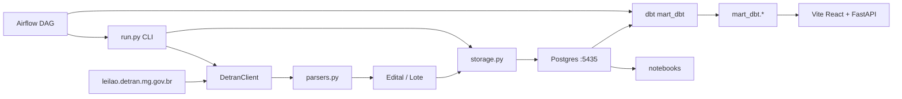

# scraping-detranmg

Local data pipeline that scrapes **auction notices and vehicle lots** from the [DETRAN/MG public auction portal](https://leilao.detran.mg.gov.br/): HTTP scraping → Postgres (`raw` / `mart`) → dbt (`mart_dbt`) → Jupyter analytics, watchlist alerts, and a local Vite/React UI.

> Portuguese docs: [`docs/README.pt.md`](docs/README.pt.md) · Technical reference: [`docs/REFERENCE.md`](docs/REFERENCE.md) · Next steps: [`docs/NEXT_STEPS.md`](docs/NEXT_STEPS.md)

## Highlights

- Layered Python package (~700 LOC): HTTP client → HTML parsers → immutable domain models → Postgres persistence
- **Raw / mart** pattern with run tracking, status history, and `first_seen_at` / `last_seen_at` for change detection
- **dbt** rebuilds `mart_dbt` from `raw` with tests and docs (parallel to Python mart until cutover); lot identity (`marca` / `modelo` / `ano_veiculo`) from `marca_modelo` + seed `marca_aliases`
- **Airflow** local DAG: daily scrape → dbt seed+run → dbt test; imagens da galeria em paralelo (`--imagens`)
- **Vite/React UI** reads `mart_dbt` via FastAPI (parsed brand/model/year on cards); interest flags in `mart.lotes_interesse`
- Resilient HTTP: browser-like headers, session cookies, exponential retry on transient errors
- Offline parser tests with HTML fixtures (no network in CI-ready tests)

## Quick start

```bash
python -m venv .venv
.venv\Scripts\activate          # Windows
# source .venv/bin/activate     # Linux/macOS

pip install -e ".[dev]"
copy .env.example .env          # DATABASE_URL → localhost:5435
docker compose up -d

# Minimal scrape (~2 min): one edital + its lots
python -m detran_scraper.run --lotes --max-editais 1
# Gallery (CONSERVADO, incremental — docs/IMAGENS.md)
python -m detran_scraper.run --imagens --max-lotes 20
python -m detran_scraper.run --export-rotulos --max-lotes 200
# python -m detran_scraper.run --import-rotulos data/imagens/rotulos/labels.csv
# Logged-in bids + lot detail fields (needs DETRAN_COOKIE in .env)
python -m detran_scraper.run --lances --max-editais 1

pytest
jupyter notebook notebooks/03_analise_mart.ipynb

# dbt (after scrape; Postgres on :5435)
pip install -e ".[dbt]"
cd transform && dbt seed --profiles-dir . && dbt run --profiles-dir . && dbt test --profiles-dir .
python scripts/reconcile_mart.py

# Browse lots + star watchlist (reads mart_dbt — run dbt first)
pip install -e ".[ui]"
python -m detran_ui
cd ui && npm install && npm run dev
# After `npm run build`, python -m detran_ui serves API + UI at :8080

# Airflow scheduler (optional — UI at :8090, UI app stays on :8080)
docker compose -f docker-compose.yml -f docker-compose.airflow.yml up -d airflow
```

## Architecture



| Layer | Module | Role |
|-------|--------|------|
| HTTP | `client.py` | Fetch pages, pagination, retry |
| Parse | `parsers.py` | Single source of truth for HTML selectors |
| Domain | `models.py` | Frozen dataclasses, `Decimal` for BRL |
| Persist | `storage.py` | Raw append + mart upsert |
| Transform | `transform/` | dbt: staging + `mart_dbt` |
| CLI | `run.py` | Orchestration |
| UI | `detran_ui/` + `ui/` | FastAPI + Vite/React: browse, filter, star lots |

## Data model

```
run.py --lotes
  ├─► raw.scrape_runs              # run metadata
  ├─► raw.editais / raw.lotes      # append-only snapshot per run
  ├─► mart.editais / mart.lotes    # current state (upsert Python, dual-run)
  ├─► mart_dbt.* (dbt)             # analytical mart (UI + cutover target)
  ├─► mart.editais_status_history  # status transitions
  ├─► mart.lotes_interesse         # UI star flag (sql/004)
  └─► mart.lotes_imagens (+ labels) # gallery CAS (sql/006; docs/IMAGENS.md)
```

**Listing fields:** edital (`leilao_id`, `municipio`, `patio`, `status`, …) and lot (`lote_id`, `marca_modelo`, `valor_atual`, `condicao`, …). dbt adds `marca`, `modelo`, `ano_veiculo`, and `ativo` on `mart_dbt.mart_lotes` (UI); `ativo` on `mart_dbt.mart_editais` (UI chip). `--lances` fills `valor_inicial`, color, `ano_modelo` / `ano_fabricacao`, fuel, increment, status, and `lotes_lances`.

## CLI

```bash
python -m detran_scraper.run              # editais only
python -m detran_scraper.run --lotes      # editais + all lots
python -m detran_scraper.run --lotes --max-editais 1
python -m detran_scraper.run --imagens
python -m detran_scraper.run --export-rotulos --max-lotes 200
python -m detran_scraper.run --import-rotulos data/imagens/rotulos/labels.csv
python -m detran_scraper.run --lances
```

## Notebooks

| # | File | Purpose |
|---|------|---------|
| 01 | `01_exploracao_editais.ipynb` | Validate edital HTTP/HTML/parser |
| 02 | `02_exploracao_lotes.ipynb` | Validate lot listing + pagination |
| 03 | `03_analise_mart.ipynb` | KPIs and Altair charts on mart |
| 04 | `04_watchlist_alertas.ipynb` | Interest filters + new-lot alerts |

Notebooks `03` and `04` require a prior `--lotes` scrape. To star lots in the GUI: `python -m detran_ui` after `dbt run`.

## Project status

| Done | Planned |
|------|---------|
| End-to-end CLI pipeline | CI (GitHub Actions) |
| Raw/mart Postgres layers | `tipo_veiculo` enrichment |
| Parser unit tests (fixtures) | AWS deploy |
| Watchlist notebook | Cutover notebooks → mart_dbt |
| dbt `mart_dbt` + reconcile script | Expose `--lances` fields (`cor`, `valor_inicial`) in UI |
| Airflow local DAG | |
| Local Vite/React lot browser (reads `mart_dbt`) | |
| Split `marca_modelo` → `marca` / `modelo` / `ano_veiculo` (dbt + UI) | |
| Gallery download (`--imagens`, CAS + human labels) | Photo quality score on valid images |

## Limitations

- Lot **listing cards** do not expose `tipo_veiculo` (portal filter only) — see [`docs/REFERENCE.md`](docs/REFERENCE.md)
- Mart does not tombstone items removed from the portal
- Scrapes only publicly available listing pages; use reasonable request rates

## Repository layout

```
scraping-detranmg/
├── src/detran_scraper/     # production scraper (EL)
├── src/detran_ui/          # FastAPI (optional extra [ui])
├── ui/                     # Vite + React client
├── transform/              # dbt: staging + mart_dbt + seeds/marca_aliases
├── airflow/dags/           # Airflow DAGs
├── scripts/                # reconcile_mart.py
├── tests/fixtures/         # offline HTML for parser tests
├── sql/                    # 001 + 002_airflow + 003_lances + 004_interesse + 005_max_editais + 006_imagens
├── notebooks/              # exploration and analytics
├── docs/                   # technical reference (PT)
└── docker-compose.yml      # Postgres on host port 5435
```

## License

MIT — see [LICENSE](LICENSE).
