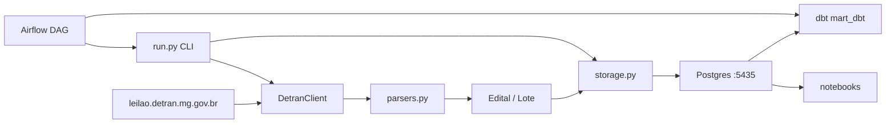

# scraping-detranmg

Local data pipeline that scrapes **auction notices and vehicle lots** from the [DETRAN/MG public auction portal](https://leilao.detran.mg.gov.br/): HTTP scraping → Postgres (`raw` / `mart`) → dbt (`mart_dbt`) → Jupyter analytics and watchlist alerts.

> Portuguese docs: [`docs/README.pt.md`](docs/README.pt.md) · Technical reference: [`docs/REFERENCE.md`](docs/REFERENCE.md)

## Highlights

- Layered Python package (~700 LOC): HTTP client → HTML parsers → immutable domain models → Postgres persistence
- **Raw / mart** pattern with run tracking, status history, and `first_seen_at` / `last_seen_at` for change detection
- **dbt** rebuilds `mart_dbt` from `raw` with tests and docs (parallel to Python mart until cutover)
- **Airflow** local DAG: daily scrape → dbt run → dbt test
- Resilient HTTP: browser-like headers, session cookies, exponential retry on transient errors
- Offline parser tests with HTML fixtures (no network in CI-ready tests)

## Quick start

```bash
python -m venv .venv
.venv\Scripts\activate          # Windows
# source .venv/bin/activate     # Linux/macOS

pip install -e ".[dev]"
copy .env.example .env          # DATABASE_URL → localhost:5435
docker compose up -d

# Minimal scrape (~2 min): one edital + its lots
python -m detran_scraper.run --lotes --max-editais 1
# Logged-in bids + lot detail fields (needs DETRAN_COOKIE in .env)
python -m detran_scraper.run --lances --max-editais 1

pytest
jupyter notebook notebooks/03_analise_mart.ipynb

# dbt (after scrape; Postgres on :5435)
pip install -e ".[dbt]"
cd transform && dbt run --profiles-dir . && dbt test --profiles-dir .
python scripts/reconcile_mart.py

# Airflow UI (optional)
docker compose -f docker-compose.yml -f docker-compose.airflow.yml up -d airflow
```

## Architecture



| Layer | Module | Role |
|-------|--------|------|
| HTTP | `client.py` | Fetch pages, pagination, retry |
| Parse | `parsers.py` | Single source of truth for HTML selectors |
| Domain | `models.py` | Frozen dataclasses, `Decimal` for BRL |
| Persist | `storage.py` | Raw append + mart upsert |
| CLI | `run.py` | Orchestration |

## Data model

```
run.py --lotes
  ├─► raw.scrape_runs              # run metadata
  ├─► raw.editais / raw.lotes      # append-only snapshot per run
  ├─► mart.editais / mart.lotes    # current state (upsert)
  └─► mart.editais_status_history  # status transitions
```

**Listing fields:** edital (`leilao_id`, `municipio`, `patio`, `status`, …) and lot (`lote_id`, `marca_modelo`, `valor_atual`, `condicao`, …). `valor_inicial` and vehicle attributes like color/year require the detail page (not scraped yet).

## CLI

```bash
python -m detran_scraper.run              # editais only
python -m detran_scraper.run --lotes      # editais + all lots
python -m detran_scraper.run --lotes --max-editais 1
```

```python
from detran_scraper import DetranClient, parse_editais, parse_lotes_from_pages

with DetranClient() as client:
    editais = parse_editais(client.fetch_home())
    pages = client.fetch_lotes_pages("/lotes/lista-lotes/3416/2026")
    lotes = parse_lotes_from_pages(pages, leilao_id=3416)
```

## Notebooks

| # | File | Purpose |
|---|------|---------|
| 01 | `01_exploracao_editais.ipynb` | Validate edital HTTP/HTML/parser |
| 02 | `02_exploracao_lotes.ipynb` | Validate lot listing + pagination |
| 03 | `03_analise_mart.ipynb` | KPIs and Altair charts on mart |
| 04 | `04_watchlist_alertas.ipynb` | Interest filters + new-lot alerts |

Notebooks `03` and `04` require a prior `--lotes` scrape.

## Project status

| Done | Planned |
|------|---------|
| End-to-end CLI pipeline | Detail-page scrape |
| Raw/mart Postgres layers | CI (GitHub Actions) |
| Parser unit tests (fixtures) | `tipo_veiculo` enrichment |
| Watchlist notebook | AWS deploy |
| dbt `mart_dbt` + reconcile script | Cutover notebooks → mart_dbt |
| Airflow local DAG | Curadoria analítica pós-cutover |

Reference run (`2026-08-09`): 87 editais, 8,605 lots. Mart counts may be higher (upsert without purge).

## Limitations

- Lot **listing cards** do not expose `tipo_veiculo` (portal filter only) — see [`docs/REFERENCE.md`](docs/REFERENCE.md)
- Mart does not tombstone items removed from the portal
- Scrapes only publicly available listing pages; use reasonable request rates

## Repository layout

```
scraping-detranmg/
├── src/detran_scraper/     # production code (EL)
├── transform/              # dbt: staging + mart_dbt
├── airflow/dags/           # Airflow DAGs
├── scripts/                # reconcile_mart.py
├── tests/fixtures/         # offline HTML for parser tests
├── sql/001_init.sql        # Postgres schema
├── notebooks/              # exploration and analytics
├── docs/                   # technical reference (PT)
└── docker-compose.yml      # Postgres on host port 5435
```

## License

MIT — see [LICENSE](LICENSE).
