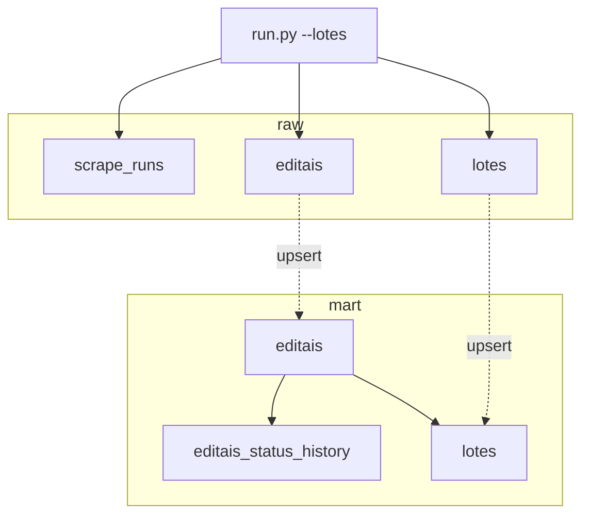
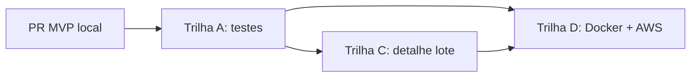

# Plano: Scraping DETRAN MG — Editais de Leilão

> Pipeline Python para extrair editais e lotes de [leilao.detran.mg.gov.br](https://leilao.detran.mg.gov.br/), validar via Jupyter, persistir em Postgres (raw/mart) e automatizar na AWS.

## Marco atual: MVP local ✅

**Escopo fechado nesta etapa (PR → `main`):**

| Fase | Status | Entregáveis |
|------|--------|-------------|
| 1 — Fundação | **Concluída** | `pyproject.toml`, `src/detran_scraper/{client,models,parsers}.py` |
| 2 — Notebook exploração editais | **Concluída** | `notebooks/01_exploracao_editais.ipynb` |
| 3 — Postgres local | **Concluída** | `docker-compose.yml` (porta **5435**), `sql/001_init.sql`, `storage.py`, `run.py` |
| 4 — Qualidade & CLI | **Parcial** | CLI + carga full validada; **faltam** testes automatizados, CI |
| 5 — Visualização | **Concluída** | `notebooks/03_analise_mart.ipynb` (Altair) |
| 6 — Expansão lotes | **Concluída** | `Lote`, `parse_lotes`, paginação, `persist_lotes`, `--lotes`, `02_exploracao_lotes.ipynb` |
| 7 — AWS | **Pendente** | Dockerfile, `infra/`, decisão ECS Fargate vs Lambda |

**Fora do escopo deste marco:** testes automatizados, scrape de detalhe do lote, deploy AWS.

Branch do PR: `feature/mvp-local-pipeline` (renomeada de `feature/fase-1-2-fundacao-exploracao`).

---

## Plano de commits (esta etapa)

| # | Mensagem | Conteúdo |
|---|----------|----------|
| 1 | `chore: add project config and environment template` | `pyproject.toml`, `.env.example` |
| 2 | `feat: implement scraper with postgres raw/mart pipeline` | `src/detran_scraper/`, `docker-compose.yml`, `sql/001_init.sql` |
| 3 | `docs: add exploration and mart analysis notebooks` | `notebooks/01_*`, `02_*`, `03_*` |
| 4 | `docs: close local MVP milestone in plan and README` | `docs/PLANO.md`, `README.md` |

---

## Snapshot da carga completa (2026-06-27)

Primeira carga limpa após truncate — `python -m detran_scraper.run --lotes`:

| Métrica | Valor |
|---------|-------|
| Editais (`mart.editais`) | **21** |
| Lotes (`mart.lotes`) | **1.481** |
| Municípios distintos | **18** |
| Status editais | 12 Publicado · 9 Finalizado |
| Condição veículos | 825 Sucata · 656 Conservado |
| Duração do scrape | ~5,5 min |
| `run_id` | `593a0393-593b-461b-95c9-f42150fe7734` |

**Top 5 editais por volume de lotes:**

| Edital | Lotes |
|--------|------:|
| 1608/2026 | 169 |
| 1643/2026 | 132 |
| 1617/2026 | 116 |
| 1692/2026 | 111 |
| 1417/2026 | 84 |

**Top 5 modelos ofertados** (heurística `MARCA · MODELO`):

| Modelo | Lotes |
|--------|------:|
| HONDA · CG 150 TITAN KS | 53 |
| HONDA · CG 125 TITAN KS | 50 |
| HONDA · CG 125 TITAN | 38 |
| HONDA · CG 125 FAN | 38 |
| YAMAHA · YBR 125K | 34 |

**Valores atuais (listagem):** min R$ 5 · mediana R$ 1.050 · max R$ 80.600

```bash
# recarregar do zero (dev local)
docker compose exec postgres psql -U scraper -d detran_leiloes -c \
  "TRUNCATE mart.editais_status_history, mart.lotes, mart.editais, raw.lotes, raw.editais, raw.scrape_runs RESTART IDENTITY CASCADE;"

python -m detran_scraper.run --lotes
```

---

## Achados técnicos (exploração + carga full)

### Editais (home `/`)

- Cards em `h5.capa-titulo` → `div.card`
- Campos: número, município, pátio, status (`Publicado`/`Finalizado`), encerramento, link para lotes
- **21 editais** listados na home no momento da carga (volume pode variar entre execuções)

### Lotes (`/lotes/lista-lotes/{leilao_id}/{ano}`)

- Card: `div.card.listaLotes` com `id` = `lote_id` global
- **8 lotes por página**; paginação via `?page=N` (até 22 páginas no maior edital)
- Campos na listagem: `numero_lote`, `condicao` (CONSERVADO/SUCATA), `marca_modelo`, `valor_atual`
- `valor_inicial` **não** aparece na listagem — só na página de detalhe (`/lotes/detalhes/{id}`)
- `Lote` usa `slots=True`: converter para DataFrame com `dataclasses.asdict()`, não `__dict__`

### Persistência

- `raw.*` append-only por `run_id`; `mart.*` upsert por `leilao_id` / `lote_id`
- FK `mart.lotes` → `mart.editais`: editais gravados antes dos lotes no mesmo run
- Histórico de status de editais em `mart.editais_status_history` (vazio na carga inicial)

### Operação

- User-Agent + cookies obrigatórios (403 sem isso)
- Scrape completo ≈ **~250–300 requests HTTP** (home + páginas de lotes)
- Portal pode desacelerar respostas sob carga (observado ~4s/página em alguns editais)

---

## O que foi desenvolvido (fase 5 — visualização)

| Componente | Descrição |
|------------|-----------|
| `03_analise_mart.ipynb` | KPIs e gráficos **Altair** (condição, volume, valores, marcas, modelos, calendário) |
| Join SQL | `mart.lotes` + `mart.editais` + metadado do último `scrape_run` |
| Enriquecimento | `marca`, `modelo`, `ano_veiculo` derivados de `marca_modelo` (heurística) |
| Seção modelos | Top 20 modelos, valor mediano, % sucata, condição empilhada |

---

## O que foi desenvolvido (fase 6 — lotes)

| Componente | Descrição |
|------------|-----------|
| `models.Lote` | dataclass com `lote_id`, `marca_modelo`, `condicao`, valores `Decimal` |
| `parsers.parse_lotes` | extrai cards `listaLotes`; `parse_brl`; `parse_lotes_max_page` |
| `client.fetch` | GET genérico com retry; `fetch_lotes_pages` percorre todas as páginas |
| `storage.persist_lotes` | INSERT `raw.lotes` + upsert `mart.lotes` |
| `run.py --lotes` | scrape editais + todos os lotes; `--max-editais` para testes |
| `02_exploracao_lotes.ipynb` | validação HTML, parser, qualidade, paginação |

---

## Modelo de dados



| Tabela | Papel | Registros (carga atual) |
|--------|-------|-------------------------|
| `raw.scrape_runs` | Metadado da execução | 1 |
| `raw.editais` | Snapshot por run | 21 |
| `raw.lotes` | Snapshot por run | 1.481 |
| `mart.editais` | Estado atual do leilão | 21 |
| `mart.lotes` | Estado atual do veículo | 1.481 |
| `mart.editais_status_history` | Mudanças de status | 0 |

---

## Próximos passos (pós-merge)

### Trilha A — Confiabilidade (recomendada)

Fixtures HTML + `pytest` offline + GitHub Actions.

### Trilha C — Detalhe do lote

Scrape de `/lotes/detalhes/{id}`: `valor_inicial`, cor, ano, combustível, placa parcial, etc.

### Trilha D — Produção → AWS

Dockerfile, EventBridge + ECS/Lambda + RDS.



---

## Riscos e dívidas técnicas

| Item | Situação | Ação |
|------|----------|------|
| Parser sem testes | Risco alto | Trilha A |
| `valor_inicial` sempre null | Limitação da listagem | Trilha C (detalhe) |
| Volume raw cresce a cada run | 1.5k lotes/run | Particionar/arquivar (futuro) |
| Rate limiting do portal | Latência variável | Backoff opcional entre editais |
| Heurística marca/modelo | Casos `I/...` imprecisos | Refinar no detalhe ou regex |

---

## Decisões pendentes

- **AWS:** ECS Fargate vs Lambda — após testes
- **Próximo foco sugerido:** Trilha A (testes) ou C (detalhe do lote)
